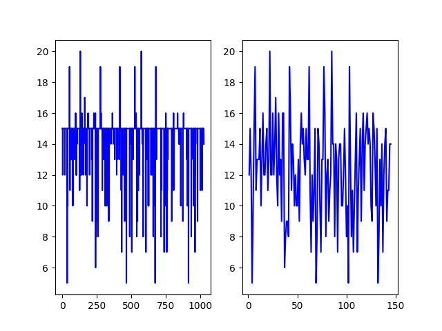
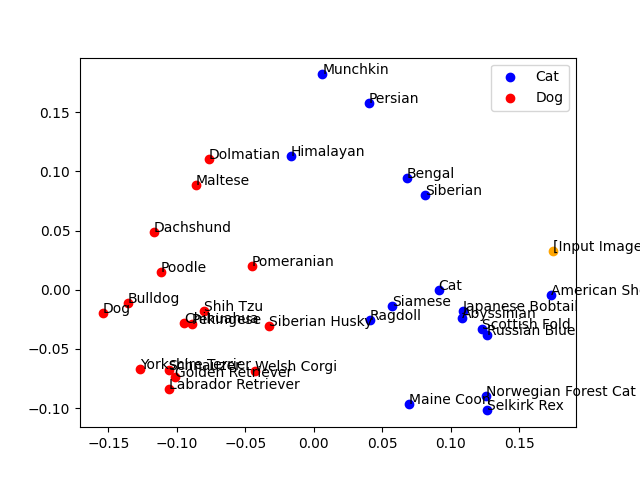

# 埋め込みベクトルの可視化と分類

## これは何？

Titan Image Embeddings の埋め込みベクトルを 2D で可視化します

## 実行条件

以下の環境での動作を想定しています

- Python 3.10

## 事前準備

以下の操作を実施して、必要なライブラリをインストールしてください

```bash
python -m pip install -r requirements.txt
```

## 実施する

以下の手順で実施、検証できます

1. **テキストデータをベクトル表現に変換する**  
   dog_name.csv と cat_name.csv のデータがベクトル表現に変換されます。

```bash
python application.py create
```

以下のように書くことで、AWS のプロファイル、リージョンを指定できます

```bash
python application.py create --profile default --region us-east-1
```

2. **マスクの作成**  
   インデックスを調べて、マスクデータを生成します。  
   左図にある水平線（全レコードで犬、または猫だと回答した次元）を除外してインデックスを削減します。削減後は右図になります。

```bash
python application.py init
```



3. **画像の検証**  
   画像データをベクトル表現に変換します。  
   dog_name.csv と cat_name.csv のテキストから取得したベクトル表現と比較をして、先頭 2 次元を可視化します。  
   赤が犬のベクトル表現、青が猫のベクトル表現、オレンジが画像データです。

```bash
python application.py read --image-file "画像ファイル"
```



なお、`image-file`として指定した画像のベクトル表現はキャッシュされて、次回実行時はキャッシュが利用されます。キャッシュが不要なら、以下のように`--disable-image-file-cache`をつけてください。

```bash
python application.py read --image-file "画像ファイル" --disable-image-file-cache
```

## その他の操作、検証

**テキストデータの分類結果を調査、可視化します**  
マスク後のデータを可視化します

```bash
python application.py read
```

**マスク前のテキストデータの分類結果を調査、可視化します**  
`index-mask-pickle-file`に無効なファイル名を指定することで、マスクが無効になります。マスクをかけずに PCA で次元削減をするため、2D グラフはでたらめな結果になります

```bash
python application.py read --index-mask-pickle-file no-mask --pca-dims 16
```

**犬、猫の基準単語のベクトル表現を可視化します**  
単語の「犬」「猫」を可視化します。インデックスの先頭 50 次元を可視化します。

```bash
python application.py read --show-criterion-graph
```

**各次元のばらつきを可視化します**  
それぞれの次元のデータがどの程度ばらついているのかを調べます。

```bash
python application.py read --show-variance-each-index
```

**PCA の削減次元数ごとの、クラス分類結果の誤答数を一覧にします**  
デフォルトでは 1 次元から 32 次元までの分類結果を回答します

```bash
python application.py read --show-classification-result
```

マスクを適用しないよう設定することで、マスクなしの場合の PCA の削減結果を確認できます

```bash
python application.py read --show-classification-result --index-mask-pickle-file no-mask
```

また、表示する次元数は`--show-classification-top`で設定できます。以下のようにすると 16 次元までを評価します。  
最大は 32 です。

```bash
python application.py read --show-classification-result --index-mask-pickle-file no-mask --show-classification-top 16
```

---

## 設定可能なオプション

設定可能なオプションは以下の通りです。  
フラグについては、引数の後ろになにもつけずに設定します。

| 引数                          | デフォルト                  | 説明                                                                  |
| ----------------------------- | --------------------------- | --------------------------------------------------------------------- |
| --embeddings-pickle-file      | embeddings.pkl              | テキストのベクトル表現変換後のファイル名                              |
| --index-mask-pickle-file      | index-mask.pkl              | マスクデータのファイル名                                              |
| --create-args-cat-csv-file    | cat_name.csv                | 猫品種名のファイルです                                                |
| --create-args-dog-csv-file    | dog_name.csv                | 犬品種名のファイルです                                                |
| --image-file                  | -                           | 調査対象の画像ファイル名です                                          |
| --image-type                  | dog                         | 調査対象の画像ファイルの格納位置です                                  |
| --disable-image-file-cache    | （フラグ）                  | このフラグを指定すると--image-file のベクトル表現をキャッシュしません |
| --show-criterion-graph        | （フラグ）                  | 単語の「犬」「猫」をグラフとして可視化します                          |
| --show-variance-each-index    | （フラグ）                  | 各次元の離散率を出力します                                            |
| --show-classification-result  | （フラグ）                  | 各次元の「犬」「猫」分類結果を可視化します                            |
| --pca-dims                    | 2                           | PCA で削減する次元数です                                              |
| --show-classification-top     | 32                          | show-classification-result で評価する最大の次元数を設定します         |
| --embedding-vector-dimensions | 1024                        | 埋め込みベクトルの次元数です。モデルごとに異なります                  |
| --model-id                    | amazon.titan-embed-image-v1 | 埋め込みベクトルのモデルです。                                        |
| --region                      | us-east-1                   | AWS のリージョンです                                                  |
| --profile                     | default                     | AWS のプロファイルです                                                |
